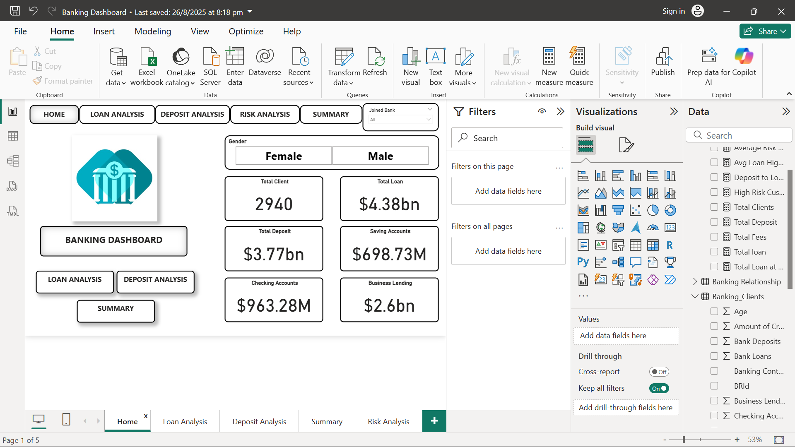
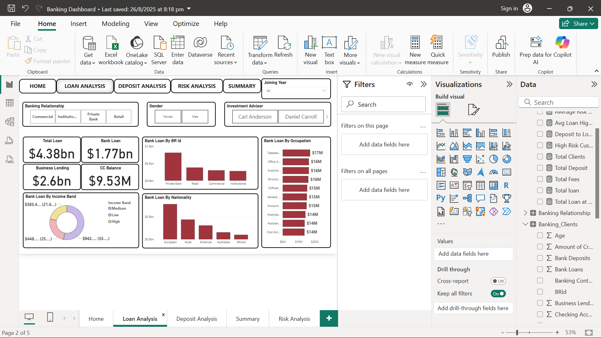
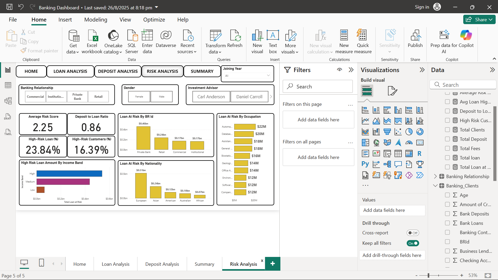
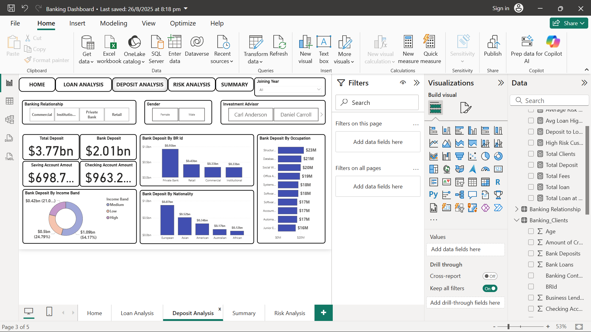

# 📊 Banking Performance & Risk Analysis Dashboard  

A Power BI project showcasing **Loan, Deposit, and Risk Analysis** for a banking dataset.  
This dashboard transforms raw client and financial data into **actionable insights** for decision-making in the banking sector.  

---

## 🚀 Project Story  

Banks sit on mountains of data – from customer loans and deposits to income bands and nationalities. But **raw numbers alone don’t help decision-makers**.  

The goal of this project was to build a **comprehensive banking analytics dashboard** that answers key questions:  

- Which customer segments hold the most loans and deposits?  
- Who contributes the most to high-risk exposure?  
- Are banks relying too heavily on specific income groups or nationalities?  
- How do advisors and banking relationships impact performance?  

This dashboard provides **clarity in complexity** by combining interactive filters, drill-downs, and KPIs into one visual story.  

---

## 📌 Dashboard Features  

### 🔹 Loan Analysis  
- Total Loans: **$4.38B**  
- Private Bank clients dominate loans (**$0.46B exposure**)  
- Top Borrower Segments: IT & Automation professionals  

💡 **Insight:** A few occupations hold disproportionately high loan amounts → potential *credit concentration risk*.  

---

### 🔹 Deposit Analysis  
- Total Deposits: **$3.77B**  
- High-Income clients contribute the most (**$1.09B**)  
- European clients lead in deposits (**$0.87B**)  

💡 **Insight:** High-income and European clients stabilize the bank’s liquidity.  

---

### 🔹 Risk Analysis  
- **16.39%** clients are classified as **High-Risk**  
- High-Risk Loan Exposure: **$1.05B**  
- Most high-risk clients surprisingly come from **High-Income Band**  
- Loan Risk by Nationality: Europeans lead with **$0.51B at risk**  

💡 **Insight:** Risk is **not limited to low-income groups** – even high-income clients can pose significant threats.  

---

### 🔹 Key KPIs  
- **Average Risk Score:** 2.25  
- **Deposit-to-Loan Ratio:** 0.86  
- Advisor-level analysis for client distribution  

💡 **Insight:** The deposit-to-loan ratio shows *cautious lending*, but hotspots of high-risk loans need proactive management.  

---

## 🛠 Tools & Skills Used  
- **Power BI** → Interactive Dashboards & Data Modeling  
- **DAX** → Custom measures for KPIs (e.g., % High-Risk Clients, Loan at Risk)  
- **Excel** → Data preparation & transformation  
- **Storytelling with Data** → Turning complex banking data into decision-friendly visuals  

---

## 📷 Dashboard Preview  

** ## 📷 Dashboard Preview  

### 🖼 Overview Dashboard  

### 🖼 Loan Analysis  

### 🖼 Risk Analysis  

### 🖼 Deposit Analysis  

---

## 🎯 Takeaway  

This dashboard empowers banking teams to:  
✔️ Identify **risky loan segments** early  
✔️ Optimize **deposit-to-loan strategies**  
✔️ Track advisor & client performance across demographics  

By shifting focus from **raw tables to visual insights**, decision-makers can manage risks and opportunities with confidence. 
